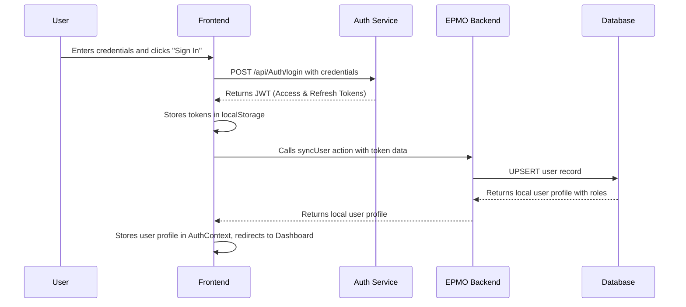
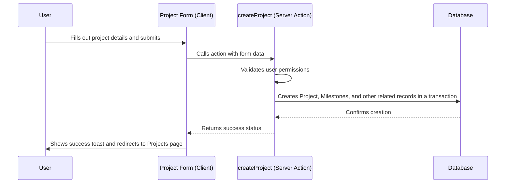

# High-Level Design (HLD) for NIB EPMO

## 1. Introduction

The NIB EPMO (Enterprise Project Management Office) application is a web-based platform designed to centralize project management within the organization. It provides tools for creating and managing projects, milestones, and tasks, tracking progress, managing teams and resources, and generating performance reports. The system aims to enhance visibility, collaboration, and governance across all projects.

## 2. Architectural Style

The application is built using a **Monolithic Frontend** architecture with a **Serverless Backend** powered by Next.js. It leverages server-side rendering (SSR) and server components for performance and SEO, while also providing a rich, interactive client-side experience.

## 3. Technology Stack

- **Frontend:** Next.js (with React), TypeScript, Tailwind CSS, shadcn/ui
- **Backend:** Next.js API Routes & Server Actions
- **Database:** PostgreSQL
- **ORM:** Prisma
- **Authentication:** External JWT-based authentication service.
- **Deployment:** Firebase App Hosting

## 4. System Components

The system is logically divided into the following key components:

### 4.1. Frontend Application (Client-Side)

- **Framework:** Built with Next.js and React, using the App Router.
- **UI Components:** A rich library of reusable components built with `shadcn/ui` and `lucide-react` for icons.
- **State Management:** A combination of React's component state (`useState`, `useReducer`) and a global `AuthContext` for managing user sessions and permissions.
- **Styling:** `Tailwind CSS` for utility-first styling, with a centralized theme defined in `src/app/globals.css`.

### 4.2. Backend Logic (Server-Side)

- **API Layer:** Implemented using Next.js Server Actions (`'use server'`). This co-locates backend logic with the components that use them, simplifying data fetching and mutations.
- **Business Logic:** All core business rules (e.g., calculating project progress, validating permissions, creating projects) are encapsulated within these server actions.
- **Database Interaction:** The backend logic uses `Prisma Client` to interact with the PostgreSQL database.

### 4.3. Database (Data Persistence)

- **Database System:** PostgreSQL.
- **ORM:** `Prisma` is used to define the schema (`prisma/schema.prisma`), manage migrations, and provide a type-safe query builder for database access.
- **Key Data Models:**
  - `Project`: The central entity, containing details like name, dates, status, and budget.
  - `Milestone`: Major phases within a project.
  - `Task`: Actionable items within a milestone.
  - `User`: Application users, with associated roles.
  - `Role`: Defines a set of permissions.
  - `Department` & `PmoDivision`: Organizational units for grouping projects and users.
  - `Team`: Groups of users assigned to specific projects.
  - `TimelineChangeRequest` & `Payment`: Models for managing project governance workflows.

### 4.4. Authentication & Authorization

- **Authentication:** The application integrates with an external authentication service via API calls. Users log in with credentials, and the app receives a JWT (Access Token) and a Refresh Token. The Access Token is used for subsequent authenticated API requests. A `syncUser` action ensures user data from the token is present in the local database.
- **Authorization:** A robust Role-Based Access Control (RBAC) system is implemented.
  - Permissions are defined centrally in `src/lib/permissions.ts`.
  - Roles are stored in the database with a list of associated permissions.
  - The `AuthContext` provides a `hasPermission` function, which checks the current user's permissions, enabling or disabling UI elements and access to specific server actions.

## 5. Data Flow Diagrams

### 5.1. User Login Flow

### 5.2. Creating a Project (Server Action)

## 6. Deployment Architecture

- The application is designed to be deployed on **Firebase App Hosting**.
- The `apphosting.yaml` file configures the backend instance.
- The PostgreSQL database is expected to be hosted externally (e.g., on Google Cloud SQL, Neon, etc.), with its connection URL provided via the `DATABASE_URL` environment variable.
- The build process (`next build`) creates a production-ready standalone Next.js server.
- The `package.json` `build` script includes `prisma db push` to synchronize the database schema before building the application.
